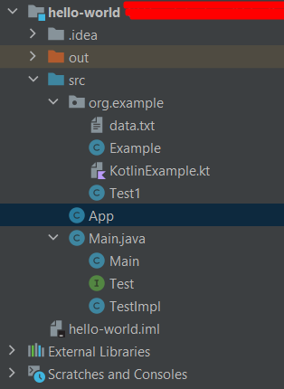
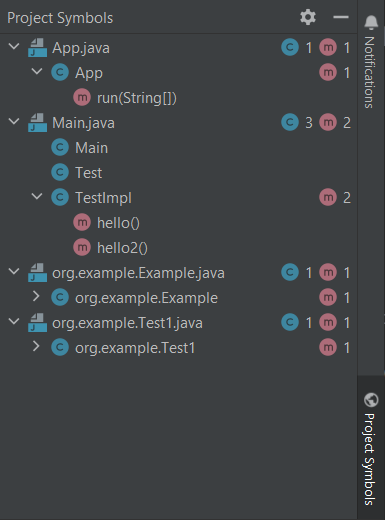

# Symbols Counter Plugin

## Functionality:
- Plugin add a custom tool window to the IDEA ui. It is located in the bottom right corner with title "Project Symbols".
- Plugin scans the source code and outputs tree-like structure of the Java files in the project with all classes and methods in those files.
- Plugin tracks changes via listening to the virtual filesystem, meaning:
  - Deleting and creating files will automatically update the tool window content.
  - Editing existing file will be propagated upon explicit saving of file: <kbd>Ctrl/Cmd</kbd> + <kbd>S</kbd> shortcut.

For the project on the 1st picture plugin will generate an output as shown on the 2nd one. Blue icon shows the number of classes per file, the red one — the number of methods per file/class.

    
    

## Implementation details:
- The plugin uses MVC structure:
  - Model: [JavaSymbolsProvider](./src/main/java/symbolscounterplugin/model/JavaSymbolsProvider.java).
  - View: [ProjectSymbolsToolWindowFactory](./src/main/java/symbolscounterplugin/ui/ProjectSymbolsToolWindowFactory.java) (contains the tool window), [SymbolsTreeCellRenderer](./src/main/java/symbolscounterplugin/ui/tree/SymbolsTreeCellRenderer.java) (contains the rendering logic for the tree-like structure that shows project symbols).
  - Controller: [SymbolsToolWindowController](./src/main/java/symbolscounterplugin/controller/SymbolsToolWindowController.java) (manages updating of the tree, creates tree nodes and tree representation in memory, updates the ui after the tree was recalculated).

## Building and running:
- Project uses gradle, so it should be enough to open it in Intellij IDEA, and it will automatically setup everything.
- In order to run an IDEA instance with the plugin integrated in it, run `gradle runIde`.
- To run tests use `gradle test`.